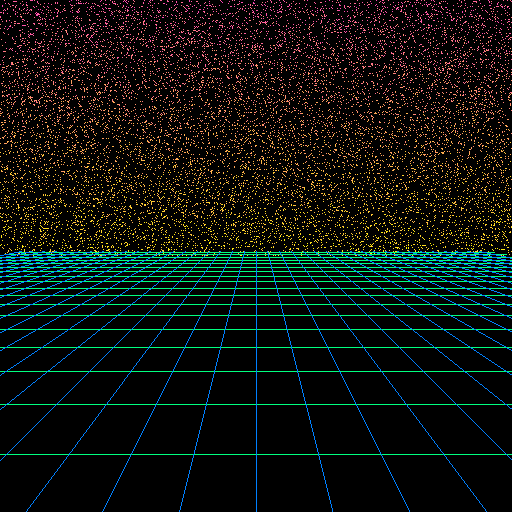
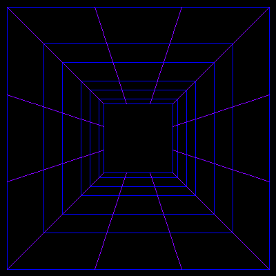
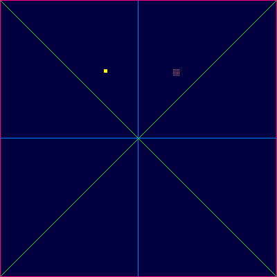
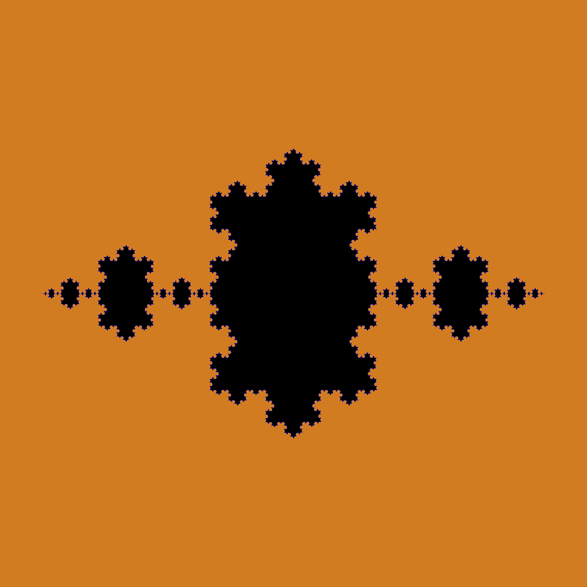
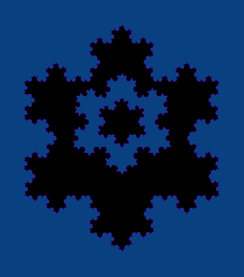
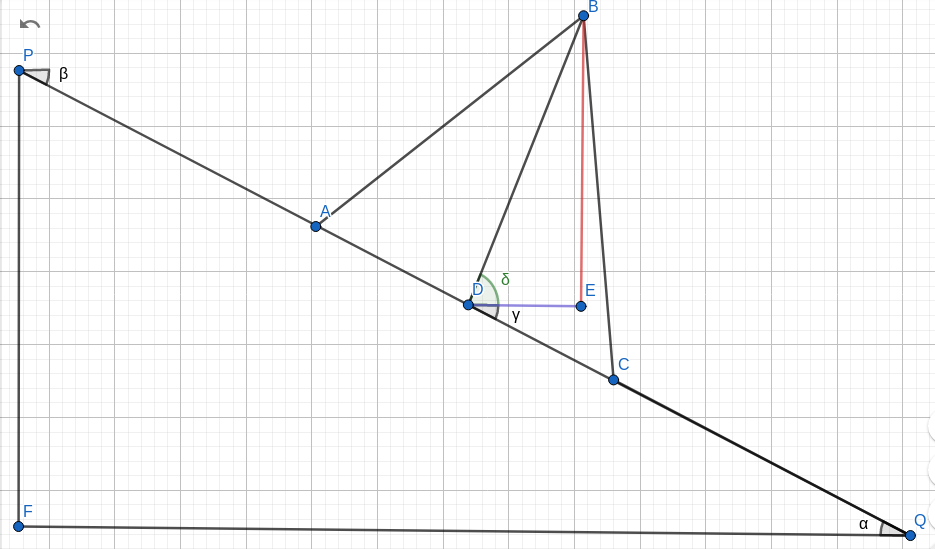

# EP1 - Introdução à Análise de Algoritmos :computer:

## O que há neste programa

- Image.java: Classe que contém toda a abstração acerca dos métodos de pintura de pixels ou de linhas, entre demais funções.
- ImageEx.java: Classe que herda Image.java e introduz as funcionalidade de:
  - Calcular uma Curva de Koch entre dois pontos dados.
  - Preencher região com a cor predominante.
- Main.java: Classe principal usada para instanciar um objeto ImageEx, ler as entradas e executar as funções/métodos requeridos.
- Diretório `entradas/`, contendo 5 exemplos de entradas possíveis. As entradas são comandos em texto que precisam ser devidamente formatados para poderem ser lidos pela classe Main.

## Como compilar e usar
### Compilando
Este programa foi feito em Java e compilado usando a versão OpenJDK-11, no ambiente Ubuntu 20.04. Julgo que qualquer versão a partir desta 11ª, além de qualquer SO compatível com o Java (o que não é tão raro) seja válida para compilar e rodar este programa, 

#### Comandos:
```sh
cd path/to/ep1
javac Main.java
```
> Serão então gerados três arquivos `.class` referente às classes utilizadas por esse programa.
> 
### Executando
#### Comandos:
```sh
cd path/to/ep1
java Main path/to/arquivo_de_entrada nome_da_imagem_gerada.[jpg|png]
```

### Exemplos de entrada
Este é um exemplo de entrada válida, referente ao arquivo [`entradas/entrada5.txt`](entradas/entrada5.txt)
```
500 567 8 64 128
SET_COLOR 76 8 193
KOCH_CURVE 250 50 450 400 3
KOCH_CURVE 50 400 250 50 3
KOCH_CURVE 450 400 50 400 3
SET_COLOR 0 0 0
REGION_FILL 250 250
SET_COLOR 76 8 193
KOCH_CURVE 250 150 350 300 3
KOCH_CURVE 150 300 250 150 3
KOCH_CURVE 350 300 150 300 3
SET_COLOR 8 64 128
REGION_FILL 250 250
SET_COLOR 76 8 193
KOCH_CURVE 300 275 200 275 3
KOCH_CURVE 200 275 250 200 3
KOCH_CURVE 250 200 300 275 3
SET_COLOR 0 0 0
REGION_FILL 250 250

```

## Imagens Exemplo
### Entradas cedidas pelo professor [Flávio Luiz Coutinho](https://latin.ime.usp.br/people/fcoutinho/)



### Entradas formuladas pelo colega de classe [Egydio Pacheco](https://github.com/egydiopacheco) 



## A lógica por trás dos algoritmos da Curva de Koch e Preenchimento de Região
### Preenchimento de Região
O algoritmo de preenchimento de Região não possui nenhum segredo senão o uso de recursão. Um pixel é pintado caso atenda aos requisitos, e então é feita uma chamada recursiva nas quatro direções cardeais.
### Curva de Koch
O algoritmo da Curva de Koch é um pouco mais complicado. Conforme explicado em [`enunciado_EP1.pdf`](enunciado_EP1.pdf), precisamos calcular os pontos A, B e C entre os pontos P e Q.

Calcular A e C é relativamente fácil, pois demanda apenas uma fórmula oriunda do princípio de Semelhança de Triângulos. Fórmula esta que, independente das posições de P e Q, funciona sempre.

A parte complicada fica como mérito do cálculo do ponto B, pois a posição de P e Q influencia na fórmula. A lógica que eu segui é a seguinte:

> Salvo alguns segmentos de retas tortos, a intenção deste diagrama é que o segmento BD seja a bissetriz do triângulo ABC. Como o triângulo ABC é equilátero, a bissetriz BD é perpendicular ao segmento AC (e PQ, consequentemente). Os segmentos PA, CQ e as arestas do triângulo ABC possuem todos o mesmo comprimento.
- Calcula-se o ponto médio entre P e Q. No diagrama, o ponto D.
- Calcula-se o ângulo delta como a diferença entre 90° e o ângulo PQF (não consigo usar o ^, perdão). Note que os ângulos alfa (ângulo PQF), beta e gama são equivalentes.
  - Exemplo 1: se P e Q estão nivelados no eixo x, o ângulo delta será de 90°;
  - Exemplo 2: se P e Q estão nivelados no eixo y, o ângulo delta será de 0°.
- Com o ângulo delta em mãos, é possível calcular o desvio do ponto B em relação ao ponto médio D tanto no eixo x como no eixo y usando mais trigonometria e a altura do triângulo ABC:
  - Altura do triângulo ABC: aresta * sqrt(3) / 2
  - Segmento DE: altura * cos(delta)
  - Segmento BE: altura * sen(delta)
1. No exemplo de P e Q no diagrama apresentado, para alcançar B a partir de D precisamos **somar o comprimento do segmento DE na coordenada x** e **subtrair o comprimento do segmento BE no eixo y**. Este é o caso em que a *coordenada x de P é **menor** que a coordenada x de Q* e o triângulo ABC "cresce pra cima".
2. Caso contrário, ou seja, *a coordenada x de P seja **maior** que a coordenada x de Q*, precisamos inverter as operações de soma e subtração apresentadas acima. Neste caso o triângulo ABC "cresce pra baixo".
3. Ainda há um caso especial: As coordenadas x de P e Q serem exatamente iguais, ou seja, o segmento PQ ser vertical: neste caso, como a convenção é que o triângulo ABC "cresça pra cima", mantemos o algoritmo do item 1. Desta forma, se P estiver acima de Q, o triângulo ABC "cresce pra direita", caso contrário, ele "cresce pra esquerda". 
## Considerações finais
Os testes deste programa não relataram qualquer incapacidade técnica senão as exceções de StackOverFlow (consequência dos algoritmos recursivos). Então, apesar de não termos evidência de erros, não devemos consider esse programa como "perfeito".
